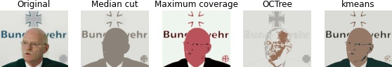
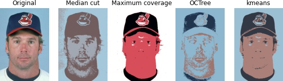
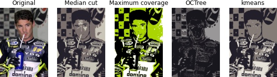
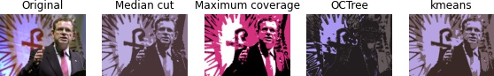
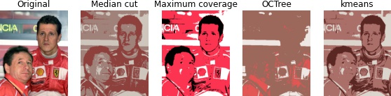

# Quantize (color reduction) experiment

## Example results

## References
[1] Vidit Jain and Erik Learned-Miller.FDDB: A Benchmark for Face Detection in Unconstrained Settings.Technical Report UM-CS-2010-009, Dept. of Computer Science, University of Massachusetts, Amherst. 2010.
